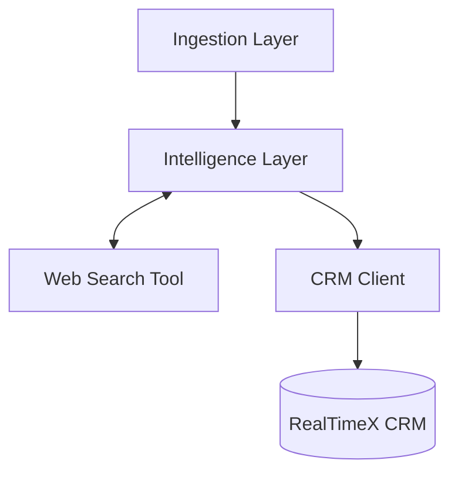

# CRM Automator: Modular Agentic CRM Toolkit

**Author**: Trung Le  
**Team**: RealTimeX.ai  
**Repository**: [https://github.com/therealtimex/crm-automator](https://github.com/therealtimex/crm-automator)

---

## Overview

The **CRM Automator** is a modular, agentic toolkit designed to transform unstructured data (emails, transcripts, documents) into structured CRM records. Unlike monolithic automation scripts, this toolkit is built as a collection of reusable **Tools** that can be orchestrated by AI agents or run as standalone pipelines.

**Current Status**: Production-Ready (v2.0)

## Key Features

-   **🧩 Modular Architecture**: Decoupled *Ingestion* (EML/Text), *Intelligence* (LLM Extraction), and *Integration* (CRM Sync).
-   **🤖 Agent-Ready**: Components like `IntelligenceLayer` and `RealTimeXClient` are designed to be imported as tools for frameworks like LangChain or Autogen.
-   **🛡️ Idempotent & Safe**: Implements "Search-before-Update" patterns and SQLite-based state tracking to prevent duplicate records.
-   **🧹 Smart Cleaning Pipeline**: Automatically converts bloaty HTML into clean Markdown, strips noise, and **resolves tracking links** (e.g., unwraps Proofpoint/Safelinks and resolves HubSpot redirects) to ensure accurate URL extraction.
-   **🧠 OpenAI-Compatible**: Works independently with OpenAI, Anthropic, or local LLMs (via LM Studio/Ollama) using `instructor`.

## Installation

1.  Clone the repository:
    ```bash
    git clone https://github.com/therealtimex/crm-automator.git
    cd crm-automator
    ```

2.  Install dependencies:
    ```bash
    pip install -r requirements.txt
    ```

3.  Configure environment:
    ```bash
    cp .env.example .env
    # Edit .env with your CRM and LLM credentials
    ```

## Usage

### 1. Process an Email (`.eml`)
Run the automator on a single EML file to sync contacts, companies, and tasks to RealTimeX CRM.

```bash
python3 em/eml_automator.py "path/to/email.eml" --env-file ".env"
```

**Options:**
-   `--force`, `-f`: Force re-processing of an email even if it was already synced.
-   `--verbose`, `-v`: Enable debug logs to see HTTP requests and LLM thought process.

### 2. Generic Agent Demo
See how the toolkit handles raw text (e.g., meeting transcripts):

```bash
python3 eml/agent_demo.py --api-key "your_key"
```

## Architecture



-   **`crm_client.py`**: The "hands" – handles all API calls with retries and 10s timeouts.
-   **`intelligence.py`**: The "brain" – uses Pydantic models to extract structured data from text.
-   **`persistence.py`**: The "memory" – prevents processing the same resource twice.

---
*Built with ❤️ by the RealTimeX.ai Team*
