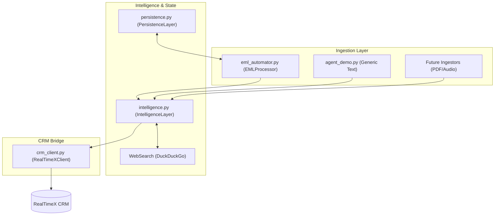

# Technical Specification: Modular CRM Automation Toolkit (v2.0)

**Status**: Implementation Complete / Verified / Production-Ready

## 1. Modular Agentic Architecture
The system has been refactored from a monolithic EML script into a tool-based architecture. This allows CRM operations to be reused across different resource types (PDF, Audio, Excel) and exposes these operations as discrete tools for an AI agent.

## 2. Component Specifications

### 2.1 [crm_client.py](file:///Users/ledangtrung/rtGit/realtimex-ai-app-agents/crm-automator/eml/crm_client.py): RealTimeX API Client
A standalone, stateless client providing idempotent CRM primitives.

- **Idempotency Strategy**: Methods like [upsert_contact](file:///Users/ledangtrung/rtGit/realtimex-ai-app-agents/crm-automator/eml/crm_client.py#76-117) and [upsert_company](file:///Users/ledangtrung/rtGit/realtimex-ai-app-agents/crm-automator/eml/crm_client.py#17-75) implement a **Search-before-Update** pattern. They query the CRM by unique identifiers (Email for contacts, Domain for companies) before performing a `POST` or `PATCH`. This prevents duplicate records and allows for "defensive" syncing.
- **Reliability**: Unified `10s` timeout policy for all requests.
- **Key Methods**: [upsert_contact](file:///Users/ledangtrung/rtGit/realtimex-ai-app-agents/crm-automator/eml/crm_client.py#76-117), [upsert_company](file:///Users/ledangtrung/rtGit/realtimex-ai-app-agents/crm-automator/eml/crm_client.py#17-75), [log_activity](file:///Users/ledangtrung/rtGit/realtimex-ai-app-agents/crm-automator/eml/crm_client.py#118-135), [create_task](file:///Users/ledangtrung/rtGit/realtimex-ai-app-agents/crm-automator/eml/crm_client.py#136-155), [create_deal](file:///Users/ledangtrung/rtGit/realtimex-ai-app-agents/crm-automator/eml/crm_client.py#156-176).

### 2.2 [intelligence.py](file:///Users/ledangtrung/rtGit/realtimex-ai-app-agents/crm-automator/eml/intelligence.py): Intelligence Layer
The semantic extraction engine powered by OpenAI-compatible LLMs and the `instructor` library.

- **Extraction**: Uses `Mode.MD_JSON` for high compatibility with local LLMs (e.g., Qwen3-4B).
- **Opportunistic Search**: If company details are sparse in the source text, the LLM generates a `company_search_query`. The toolkit then performs a web search and a second LLM pass to merge enriched data into the final model.
- **Grounding**: Extracts relative dates (e.g., "next Tuesday") and grounds them against a provided `context_date` into ISO formats.

### 2.3 [persistence.py](file:///Users/ledangtrung/rtGit/realtimex-ai-app-agents/crm-automator/eml/persistence.py): State Management
A local SQLite backend for long-term idempotency.

- **Logic**: Tracks `resource_id` (e.g., `Message-ID` for emails or `File-Hash` for documents).
- **Storage**: [eml/test-run/processed_resources.db](file:///Users/ledangtrung/rtGit/realtimex-ai-app-agents/crm-automator/eml/test-run/processed_resources.db).

## 3. Data Models (Pydantic)

The toolkit uses strict Pydantic models for data validation and LLM extraction:

- **[AnalysisResult](file:///Users/ledangtrung/rtGit/realtimex-ai-app-agents/crm-automator/eml/intelligence.py#53-62)**: The primary extraction container (Summary, Sentiment, Intent, SenderInfo, CompanyDetails, SuggestedTasks, DealInfo).
- **[CompanyDetails](file:///Users/ledangtrung/rtGit/realtimex-ai-app-agents/crm-automator/eml/intelligence.py#23-35)**: Includes sector, size, revenue, website, and physical address fields.
- **[ExtractedTask](file:///Users/ledangtrung/rtGit/realtimex-ai-app-agents/crm-automator/eml/intelligence.py#36-40)**: Contains description, due_date (ISO), and priority.
- **[DealInfo](file:///Users/ledangtrung/rtGit/realtimex-ai-app-agents/crm-automator/eml/intelligence.py#41-45)**: Suggested name, amount, and CRM stage.

## 4. Verification & Proof of Concept

The system's modularity was verified across two distinct scenarios:

1.  **EML Ingestion**: The [EMLProcessor](file:///Users/ledangtrung/rtGit/realtimex-ai-app-agents/crm-automator/eml/eml_automator.py#17-208) in [eml_automator.py](file:///Users/ledangtrung/rtGit/realtimex-ai-app-agents/crm-automator/eml_automator.py) was refactored to compose the modular tools. It correctly handles complex HTML emails and extracts participants, logging activities and tasks successfully.
2.  **Generic Text Ingestion**: The **[agent_demo.py](file:///Users/ledangtrung/rtGit/realtimex-ai-app-agents/crm-automator/eml/agent_demo.py)** script demonstrates how an AI agent can ingest arbitrary text (e.g., a meeting transcript mentioning "Sarah Connor @ Cyberdyne") and directly sync it to the CRM using the [IntelligenceLayer](file:///Users/ledangtrung/rtGit/realtimex-ai-app-agents/crm-automator/eml/intelligence.py#63-120) and [RealTimeXClient](file:///Users/ledangtrung/rtGit/realtimex-ai-app-agents/crm-automator/eml/crm_client.py#5-176) alone.

---
*Authored by Antigravity (Advanced Agentic Coding)*
